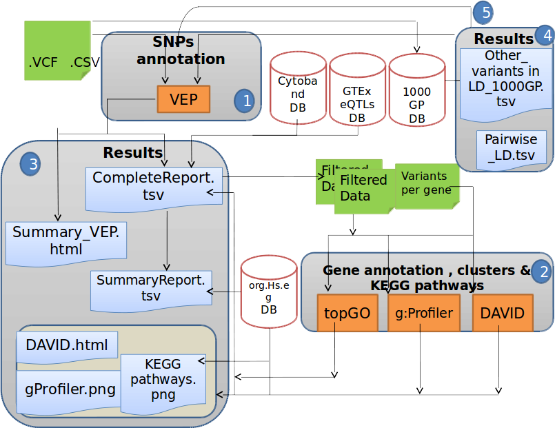

# <i class="fa fa-download"> Download</i>

1. Install Docker from the official web site
  - [Linux](https://docs.docker.com/engine/installation/#supported-platforms)
  - [Mac](https://docs.docker.com/docker-for-mac/install/#download-docker-for-mac)
  - [Window](https://docs.docker.com/docker-for-windows/install/) (In case it is needed, use _[docker toolbox](https://www.docker.com/products/docker-toolbox)_ )
       - Notice: Activate BIOS VT-X/AMD-v if is not enabled. Enabling it in the BIOS is mandatory

2. Download the DoriTool repository

    - `git clone https://github.com/doritool/doritool.git`

     or the zip file

    - <https://github.com/doritool/doritool/archive/master.zip>

    Notice:

    For window's users download the DoriTool repository using cmd (click windows R and write cmd, the shell will be opened). Or directly from the docker toolbox Shell.

3. See the next section for learning how to run the _doritool_ script (the first time, the docker image will be downloaded, be patient)

--------------------
# <i class="fa fa-play"> Quick start</i>

1) Go to GitHub Repository at <https://github.com/doritool/doritool> and read the Readme.md file. DoriTool uses _GRCh37_ human assembly.

2) Input data a mutation/variant call format file (VCF) or an rs identifier SNP list.

3) Perform the functional in silico analysis from the shell as follows bellow

- Linux users

    `./doritool`

- Windows users

    `doritool.bat`

Run one of these scripts with the next parameters

3.1. Variant annotation analyslis (without Linkage Disequilibrium and eQTLs).

There are two ways to specify the input file (`--  input`,  `-i file` )

`-i web.rs`

`-- web.rs`

3.2. Variant annotation analysis with linkage Disequilibrium (`--LD` , `-l`). Notice the cutoff must be specified.

`-l 0.90 -i web.rs`

`--LD 0.90 -i web.rs`

3.3. Variant annotation analysis with eQTLs (`--GTEx` , `-e`). Notice that the specific human tissue required must be downloaded previously from
<https://www.gtexportal.org/home/>

`--GTEx Brain_Caudate_basal_ganglia_Analysis.nominal.filtered.txt -i web.rs`

`-e Brain_Caudate_basal_ganglia_Analysis.nominal.filtered.txt -i web.rs`

3.4.Variant annotation analysis with Linkage Disequilibrium and eQTLs

    -l 0.90 -e Brain_Nucleus_accumbens_basal_ganglia_Analysis.nominal.filtered.txt -i web.rs.

DoriTool allows performing a functional '_in silico_' analysis at

- Mutation/variant level, performing annotation of a set of mutations/variants, reporting eQTL results from GTEx and providing their linkage disequilibrium (LD) proxies.

- Gene level, performing annotation of the genes tagged by the set of input variants and reporting also their Gene Ontology.

- Pathway level.

- Network level.

--------------------

Schematic diagram of the DoriTool architecture. The workflow starts with an input file (VCF format, list of chromosome positions of the variants and their alleles or list of variant rs identifiers).

1) Variant Effect Predictor annotates the input variants with the tagged gene, the impact and some annotations described in the main text, querying Ensembl database. The next step involves locating the variants in their corresponding cytobands, and the user has the option to query the GTEx database locally by providing a tissue-specific file with the eQTLs.

2) DoriTool uses topGO (FGNet), g:Profiler and DAVID (FGNet) R packages to produce Gene Ontology terms, functional networks, enriched pathways and other annotations.

3) The main output files are the CompleteReport that contains all the annotations at transcript level provided by VEP, the SummaryReport that includes only felected information from the former, and collapsing the results by gene and effect in the transcript.

4) As an option, the user may ask for Linked variants in a window size of 500 Kb, with an LD cutoff specified in the main call.

5) In case the user has asked the previous task, a new CompleteReport profiling the linked variants will be produced.
