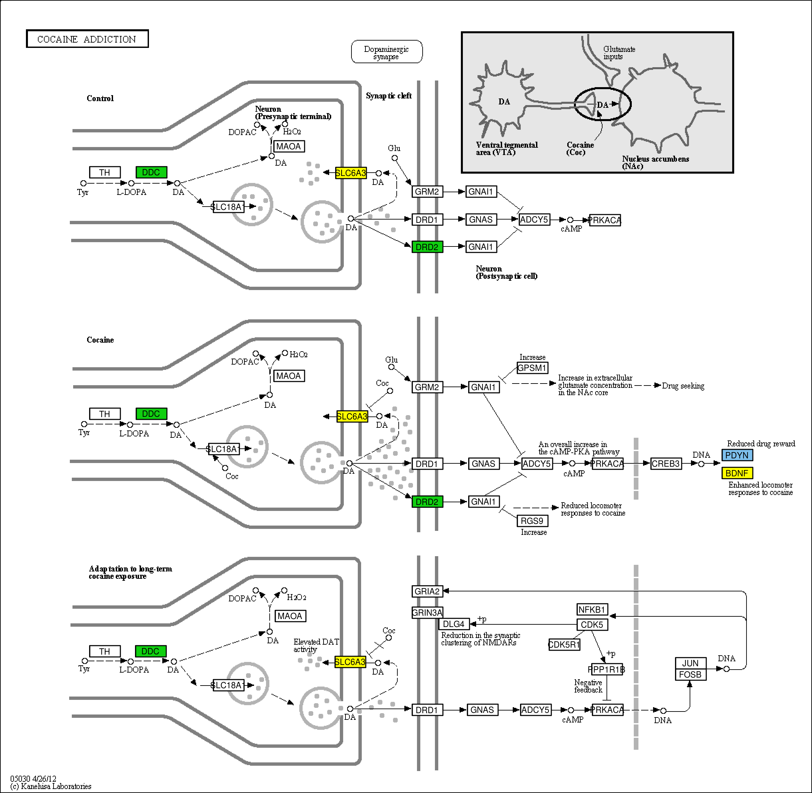
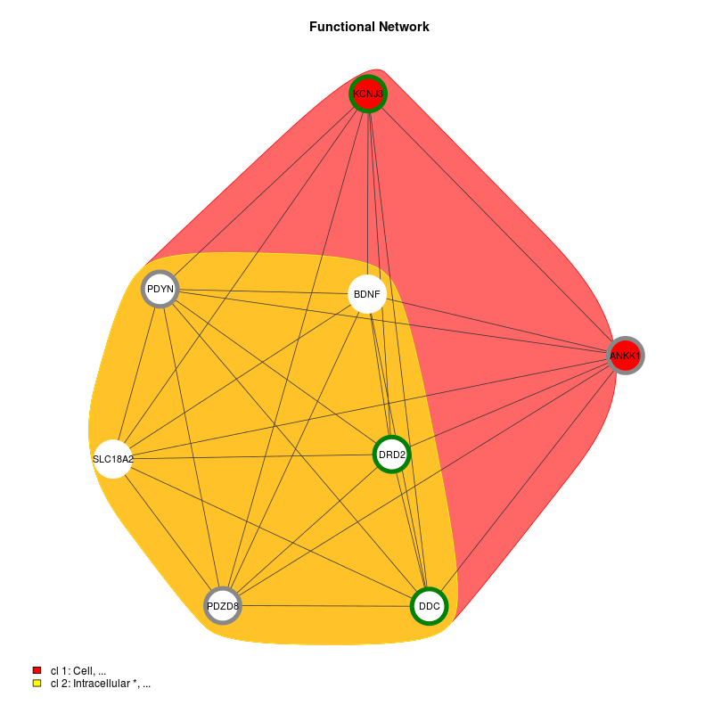
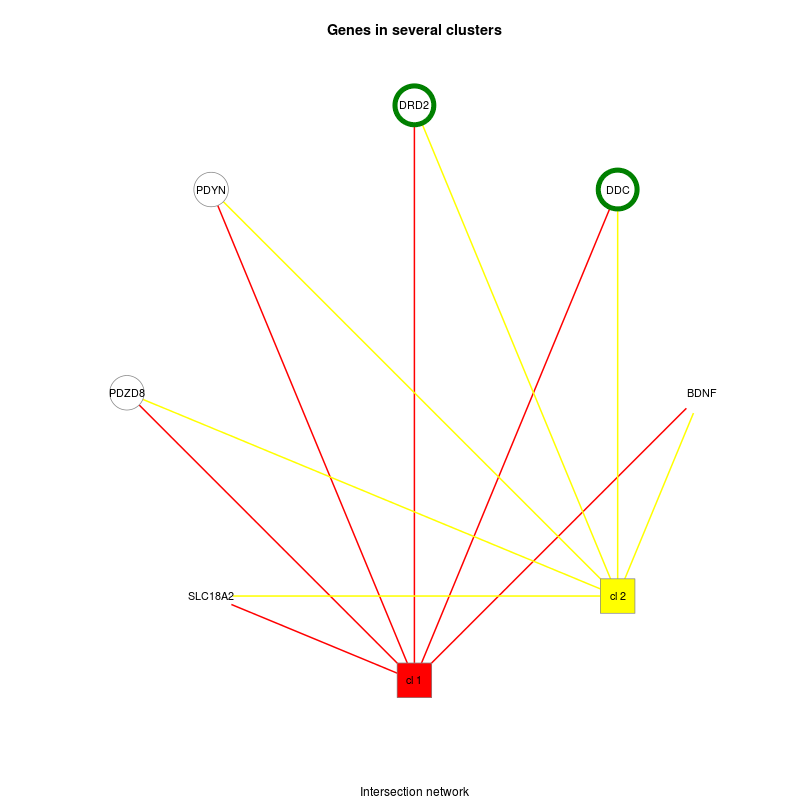

DoriTool was designed for a post-association analysis (e.g., GWAS, NGS).
Here we present DoriTool outputs by applying it in to a dataset of 23 SNPs related with drugs abuse which were selected ad hoc to show the scope and the full potential of DoriTool.

[Click here to download SNPs file](download/snps.txt){:target="_blank"}

Several output files were obtained: four text files ([SummaryReport.tsv](download/SummaryReport.tsv){:target="_blank"}; [CompleteReport.tsv](download/CompleteReport.tsv){:target="_blank"}; [pairwise_LD.tsv](download/pairwise_LD.tsv){:target="_blank"}; [other_variants_in_LD_1000GP.tsv](download/other_variants_in_LD_1000GP.tsv){:target="_blank"}), an image ([gprofilerResults.png](/download/gprofilerResults.png){:target="_blank"}), two HTML files ([DAVID.html](download/DAVID.html){:target="_blank"}; [Summary_VEP.html](download/Summary_VEP.html){:target="_blank"}), and four folders (DAVID, KEGG, topGO and VEP), containing the results obtained in each module of DoriTool.

1) Mutation/variant level
Variant annotation. Input variants are functionally annotated using VEP for the analysis, annotation, and prioritization of genomic variants in both coding and non-coding regions. VEP allows determining the effect of the variants (SNPs) on genes, transcripts and proteins, as well as regulatory regions, non-genic variants, and including transcription factor binding sites (TFBS), using regularly updated data files that are distributed by Ensembl and its output follows a standard form (VCF).
DoriTool also locates each variant in its corresponding cytoband, retrieving the information from the database downloaded from UCSC hg19.

SummaryReport.tsv is a tab-delimited text file containing in each row, apart from the input information related to the mutation/variant, its consequence defined by the Sequence Ontology (http://www.sequenceontology.org/), its impact (high, moderate, low, modifier), transcript quality flags (cds_start_NF: CDS 5' incomplete, cds_end_NF: CDS 3' incomplete), the symbol of the gene tagged by that variant (considering a region of 10 Kb upstream of the TSS and 5 Kb downstream of the gene end), information regarding the transcription factor binding site (TFBS) related to the variant, the nearest gene in case of intergenic variants, the Condel score (i.e., a consensus score considering SIFT and PolyPhen-2, which ranges 0-1, being 0 neutral and 1 deleterious), the cytoband, the KEGG pathway in which the tagged gene was annotated and the Gene Ontology term. Table 3 contains the first rows of our example.

Table 2 SummaReport.tsv

--------------------

The ouput file CompleteReport.tsv is also a tab-delimited text file containing in each row, apart from the information reported in the SummaryReport.tsv file, additional information as feature identifier and feature type (e.g., transcript, regulatory feature…), position of the input variant in cDNA, coding sequence and protein position of the input variant, changed aminoacid, codon change (the alternative codons with the variant base in upper case), existing variation (dbSNP or COSMIC variations), distance to the transcription start site, strand of the feature, source of the symbol (e.g., VEGA, Ensembl or HGNC) and HGNC id.

Table 3 CompleReport.tsv

--------------------

Expression QTLs. For this specific dataset it was considered Brain_Caudate_basal_ganglia_Analysis.nominal.filtered.txt tissue-specific significant SNP- gene pairs to obtain the effect size of the eQTL as well as the eGene.

Table 4. (eQTLs.tsv)

--------------------

Linkage Disequilibrium proxies (optional). DoriTool also explores proxy and putatively functional SNPs for a query SNP in a selected 1000GP population, using the Ensembl REST API in an integrated Perl script [19]. It computes and returns pairwise LD values 1) among the input variants and 2) between each input variant and all other variants in a surrounding window. The default parameters in DoriTool for window size and strength of LD (r2) are 500 Kb and 0.90.

Table 5. (pairwise)

--------------------

Table 6. (other_variants_in_LD_1000GP_EU)

--------------------

2) Gene level
Gene annotation. DoriTool uses three different tools to perform the gene annotation, and therefore allowing interpreting and identifying the biological processes for the gene list tagged by the input list of mutations/variants.
2.1) org.Hs.eg.db annotation package.
The Entrez Gene identifiers mapped to an Ensembl gene are obtained using the genome wide annotation for human org.Hs.eg.db. DoriTool retrieves the following gene information to annotate: Symbol, gene name, OMIM identifier (Online Mendelian Inheritance in Man) and focuses primarily on inherited or heritable genetic diseases), Gene Ontology identifiers, protein families (PFAM) and Pathway.

Table 7 (gene annotation tsv)

--------------------

2.2) FGNet, which uses TopGO R package.
topGO facilitates semi-automated enrichment analysis for Gene Ontology (GO) terms mapping the genes tagged by the input variants with the associated biological annotation terms (e.g. GO Terms), and then statistically examine the enrichment of gene members for each of the annotation terms on the basis of gene counts. (See Table 1 and 2)

2.3) g:Profiler R package.
g:Profiler performs Functional Enrichment Analysis, including transcription factor binding site predictions, Mendelian disease annotations, information about protein expression and complexes, statistically significant Gene Ontology terms, pathways and other gene function related terms.
DoriTool manages the output given by g:Profiler as a visual report that complements and helps to interpret the results given by the other tools.

Table 8 (g:profiler)

--------------------

3)Pathway level
Pathway annotation. It is performed using three R packages: FGNet, which uses DAVID, org.Hs.eg.db, which maps Entrez Gene identifiers to KEGG pathways.
For the DoriTool pipeline, we included a code to obtain coloured KEGG pathways considering the number of variants per gene by using KEGGprofile.

Table 9 (pathway)

--------------------

4) Network level
DoriTool also provides coloured Functional Networks of the list of genes tagged by the input variant list. These functional connections between the different genes were based on annotations (GO) and given by DAVID functions included in FGNet. Building functional networks provides an overview of the biological functions of the genes/terms, and permits links between genes, overlapping between clusters.

Figure 10 shows two clusters into gene-term groups in green (only one variant) and white circles (2 variants). Genes in solid colour have a unique cluster (and their color corresponds to the one shown in the legend), while genes with a white background are shared genes between clusters. The second shows the intersection network, which is a simplified functional network where all the genes that belong to only one metagroup are clustered into a single node. Clusters are represented by square boxes and genes are circles.

Figure 10

