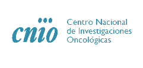

# <i class="fa fa-pencil-square-o"></i> Citation
When using Doritool for a publication please cite as

_DoriTool: A bioinformatics integrative tool for post-association functional annotation_. Public Health Genomics. 2017

-------------------------

# <i class="fa fa-thumbs-up"></i> <a href="https://goo.gl/forms/M2bbiRFgprJxD8Ap2" target="_blank">Feedback</a>

-------------------------

# <i class="fa fa-envelope"> Contact

<i class="fa fa-envelope-o"></i> <a href="mailto:doritool@outlook.com">Contact us<a/>

<i class="fa fa-location-arrow"> </i> Localization and support at:

  - Genetic and Molecular Epidemiology Group, Spanish National Cancer Research Centre (CNIO), Madrid, CIBERONC, Spain. C/Melchor Fernandez Almagro, 3, 28029,
Phone: +34-912-246-900, Fax: +34-912-246-911

  - Instituto de Medicina Molecular Aplicada (IMMA), Facultad de Medicina, Universidad San Pablo CEU. Madrid, Spain. Urb. Montepríncipe Ctra. Boadilla, km 5,30028668 Boadilla del Monte (Madrid). Phone: +34914 56 63 00

 

